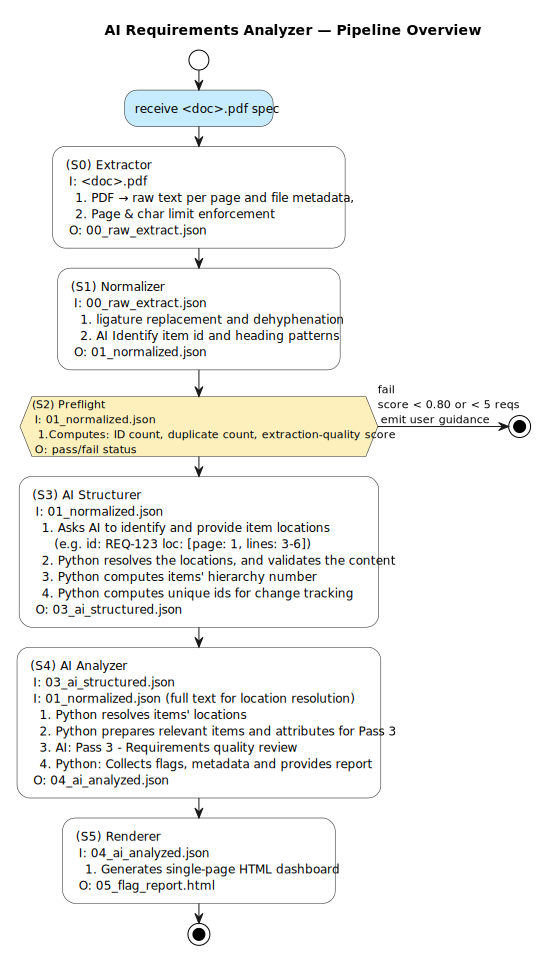

# reqs_analyzer

AI-powered review pipeline for embedded software and systems requirements documents.

Accepts a born-digital PDF specification, runs it through a deterministic preprocessing pipeline, then uses Claude (Anthropic) to structure its content and flag quality issues — producing a structured JSON output and (planned) an HTML report.

---

## Pipeline Overview



> Source: [`pipeline_overview_v1.puml`](architecture/pipeline_overview_v1.puml)

---

## Input Constraints (v1)

| Constraint     | Value                  |
|----------------|------------------------|
| Format         | Born-digital PDF       |
| Max pages + Max Characters| See MAX_PAGES and MAX_CHARS at `pipeline_root/src/S0_extractor.py` |

---

## Pipeline Stages & Artifacts

See the [stage map in llm_context.md](llm_context.md) for the
authoritative stage-to-artifact mapping, and
[`architecture/pipeline_overview_v1.puml`](architecture/pipeline_overview_v1.puml)
for the visual flow.

Artifacts land in `pipeline_root/artifacts/<project>/<spec>/`.

---

## Requirements

- Python 3.11+
- An LLM API key, for example [Anthropic's](https://console.anthropic.com)

---

## Setup

```bash
git clone <repo-url>
cd reqs_analyzer

python -m venv venv
source venv/bin/activate      # Windows: venv\Scripts\activate
pip install -r requirements.txt

cp .env.example .env
# Edit .env and add your ANTHROPIC_API_KEY
```

---

## Usage

```bash
source venv/bin/activate

make s0   # through s4, or:
make pipeline

# Custom input:
INPUT_PDF=pipeline_root/input/my_project/my_spec/my_spec.pdf make analyze
```

See [llm_context.md](llm_context.md) for the full run command
reference and stage details.

To analyze your own specification:

1. Add your PDF under `pipeline_root/input/<project>/<spec>/<your_file>.pdf`
2. Run the pipeline with `INPUT_PDF=...`
3. Find the generated HTML analysis under `pipeline_root/output/<project>/<spec>/`

Example:

```bash
source venv/bin/activate

INPUT_PDF=pipeline_root/input/my_project/my_spec/my_spec.pdf make analyze
```

LLM-backed stages (`S1`, `S3`, `S4`) require explicit approval on
every run before they call the Anthropic API. In an interactive shell,
the script will prompt you to type `yes`. For non-interactive usage,
set `ALLOW_LLM_EXECUTION=1` on that command invocation only.

The guard configuration is read from `~/.reqs_analyzer/llm_guard.json`,
outside this repository. If that file is missing, the guard stays
enabled by default. To disable the guard intentionally, create:

```json
{"enabled": false}
```

Because this file lives outside the repo, an in-repo code change cannot
silently disable the guard.

Repository policy: direct `anthropic.Anthropic(...)` calls are only
allowed in `pipeline_root/src/llm_guard.py`. All LLM-backed stages must
go through the shared guard.

---

## Demo Run

Use the bundled ARVMS sample specification at
`pipeline_root/input/arvms_specs/arvms_spec/arvms_spec.pdf`
to run the full pipeline end to end:

```bash
source venv/bin/activate

make analyze
```

This runs the stages against the default demo input configured in
the `Makefile`.

After the run, you can inspect:

- The generated HTML report in
  `pipeline_root/output/arvms_specs/arvms_spec/arvms_spec_llm_analysis.html`
- The generated pipeline artifacts in
  `pipeline_root/artifacts/arvms_specs/arvms_spec/`

If you want to open the HTML report locally in a browser, use the file
under `pipeline_root/output/...`.

---

## Project Structure

```
reqs_analyzer/
  architecture/           Architecture diagrams and design docs (PlantUML)
  pipeline_root/
    src/
      S0_extractor.py     Stage 0 — PDF text extraction
      S1_normalizer.py    Stage 1 — Text normalization
      S2_preflight.py     Stage 2 — Preflight gate
      S3_llm_structurer.py  Stage 3 — LLM structuring + content resolution
      S5_llm_analyzer.py  Stage 5 — LLM analysis (planned)
      S5_renderer.py      Stage 6 — Report rendering (planned)
      prompts/            LLM prompt definitions
    artifacts/            Intermediate JSON outputs (gitignored in production)
    input/                Input PDF specs — see input/arvms_specs/ for examples
    tests/                Test plans and test inputs
  requirements.txt
  .env.example
```

---

## Status

| Stage | Name           | Status   |
|-------|----------------|----------|
| S0    | Extractor      | Complete |
| S1    | Normalizer     | Complete |
| S2    | Preflight      | Complete |
| S3    | LLM Structurer | Complete |
| S4    | LLM Analyzer   | Complete |
| S5    | Renderer       | Planned  |

---

## Domain Context

This tool is designed for embedded systems and safety-critical engineering, targeting documents that follow standards such as ISO 26262 and ASPICE. The LLM analysis prompt is scoped to flag:

V1.0: 
- Requirements quality including:
  - Ambiguity, testability, atomicity, overconstraint, completeness and terminology.
Future:
- Ambiguity and underspecification
- Missing safety or ASIL context
- Traceability gaps
- Consistency problems across requirements

---

## License

MIT — see [LICENSE](LICENSE)

---

## Author

This project was developed by Jair Jimenez, Systems & Software Architect 
specialized in AI-augmented embedded and safety-critical system development with ADAS expertise.

For consulting, customization, or enterprise integration inquiries:
📩 jairjimenezv@gmail.com
🌐 linkedin.com/in/jairjimenezv
